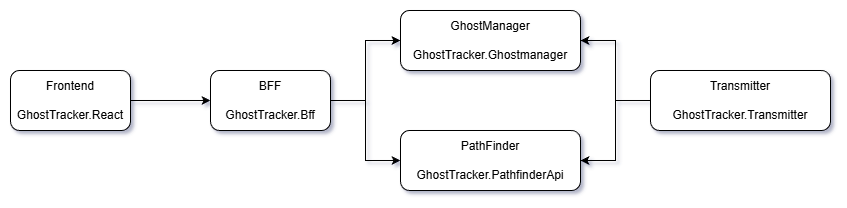

# Aspire Workshop

## What You'll Learn
In this hands-on workshop, you'll learn how to use .NET Aspire to build, orchestrate, and deploy a distributed application. By the end, you'll understand:
- How Aspire orchestrates multi-service applications
- Service discovery and inter-service communication
- Integrating third-party services (RabbitMQ)
- OpenTelemetry for observability
- Deploying Aspire apps to Azure

## What Is Aspire?
Aspire is an opinionated, cloud-ready stack for building observable, production-ready distributed applications. It provides tools for service orchestration, telemetry, and deployment across local development and cloud environments.

## The Ghost Tracker Application
We'll be working with Ghost Tracker, a distributed application that monitors paranormal activity. The application demonstrates real-world patterns for microservices, event-driven architecture, and cloud deployment.

### Architecture Overview

### Services

**Frontend** (React SPA)  
A web interface displaying a real-time map of active ghost locations.

**BFF** (Backend for Frontend - ASP.NET Web API)  
Public-facing API that aggregates data from backend services for the frontend. Implements the BFF pattern to simplify client communication.

**GhostManager** (ASP.NET Web API)  
Maintains the registry of all ghosts, including metadata and current status. Acts as the source of truth for ghost entities.

**PathFinder** (ASP.NET Web API)  
Tracks and stores real-time location data for each ghost. Separated from GhostManager to demonstrate microservice boundaries.

**Transmitter** (Background Service)  
Simulates IoT devices attached to ghosts. Each transmitter sends periodic location updates to GhostManager and PathFinder. We'll create multiple transmitter instances to simulate a fleet of IoT devices.

**Transmitter.RabbitMQ** (Background Service)  
Alternative transmitter implementation using message queues instead of HTTP, demonstrating event-driven architecture.

## Workshop Structure
The workshop is divided into steps, each building on the previous:
0. Environment setup
1. Project exploration and AppHost creation
2. Service orchestration
3. OpenTelemetry and observability
4. Service discovery
5. Running multiple instances
6. Message queue integration
7. Interaction service
8. Integration testing
9. Cloud deployment

Let's get started! 👻

---

# Step 0 - Getting the correct tools

## Prerequisites Checklist

Before starting this workshop, ensure you have the following installed:

- [ ] **.NET 10.0 SDK or later** - Download from [dotnet.microsoft.com](https://dotnet.microsoft.com/download)
- [ ] **Docker Desktop** - Required for running containers (RabbitMQ, etc.)
- [ ] **IDE**: One of the following:
  - Visual Studio 2022 (17.10+) with Web and Cloud workload
  - Visual Studio Code with [C# Dev Kit extension](https://marketplace.visualstudio.com/items?itemName=ms-dotnettools.csdevkit)
  - JetBrains Rider (2024.1+)
- [ ] **Aspire CLI** - `irm https://aspire.dev/install.ps1 | iex`

## Installation Instructions

### For Visual Studio Users

If you are using Visual Studio and have the Web and Cloud workload installed, Aspire should already be installed and you are good to continue.

### For VS Code Users

If you are using VS Code to develop, make sure to install the [C# Dev Kit extension](https://marketplace.visualstudio.com/items?itemName=ms-dotnettools.csdevkit) from the Visual Studio Code Marketplace. This will make a few things simpler when developing with Aspire.

### For Rider Users

If you are using Rider, install the [.NET Aspire plugin](https://www.jetbrains.com/help/rider/NET_Aspire.html) from JetBrains Marketplace. The plugin provides full support for .NET Aspire development and you don't need to install the Aspire workload separately.

## Additional Resources

- [What is Aspire?](https://aspire.dev/get-started/what-is-aspire)
- [Set Up Your Aspire Environment](https://aspire.dev/get-started/prerequisites)

---

[Next Exercise →](./exercise_01.md)
