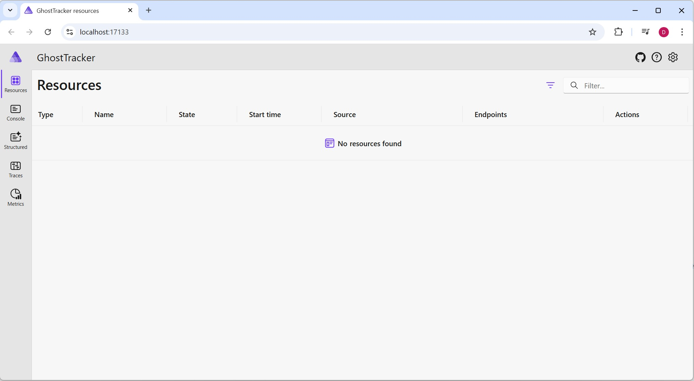

# Step 1 - Project exploration

Navigate to the "Starter" folder and open the solution file `Starter/GhostTracker.sln`. 

## What to Look For

During your exploration, notice:
- Each service (Bff, GhostManager, PathFinderApi) is a separate ASP.NET Core Web API project
- The React frontend in GhostTracker.React
- The Transmitter projects that will simulate IoT devices

Take a moment to explore the code structure before proceeding.

## Initialize Aspire

To start using Aspire in our project, we'll use the .NET Aspire CLI to add the necessary projects to our solution.

Open a terminal in the `Starter` folder (where the GhostTracker.sln file is located) and run:

```powershell
aspire init
```

The CLI will guide you through an interactive setup:
1. Choose to add all existing projects to the orchestration
2. Choose to add ServiceDefaults to all existing projects
3. Select the latest .NET Aspire version (13.1.2)
4. The tool will create:
   - `GhostTracker.AppHost` - The orchestration project
   - `GhostTracker.ServiceDefaults` - Shared service configurations

The AppHost project contains one main code file, the "AppHost.cs" file:

```c#
var builder = DistributedApplication.CreateBuilder(args);

builder.Build().Run();
```

## Understanding the AppHost

The `DistributedApplication.CreateBuilder()` creates a builder similar to the WebApplication builder you may know from ASP.NET Core. This builder will orchestrate all your services. The `Build()` method constructs the application, and `Run()` starts it.

## Understanding Service Defaults

The `GhostTracker.ServiceDefaults` project is a shared configuration library created by the Aspire CLI. It contains common service configurations and extensions that are used across all your services in the solution.

This project includes helper methods and configurations for:
- Adding resilience and retry policies
- Configuring distributed tracing and logging
- Setting up health checks
- Configuring OpenTelemetry for observability

**Note:** You don't need to do anything with the ServiceDefaults project right now. These configurations are automatically applied to your services, and we'll leverage them in upcoming steps. For this exercise, just be aware that it exists and provides a centralized place for shared service configurations.

## Run the Application

Now run the solution by setting the AppHost project as the startup project of your solution or run `dotnet run` from the GhostTracker.AppHost folder.

Our Aspire application will be started and a browser will open with the Aspire dashboard.

### Expected Behavior
- The application should start within a few seconds
- A browser window should automatically open showing the dashboard
- If the browser doesn't open automatically, look for the dashboard URL in the terminal output (typically https://localhost:15888 or similar)



The dashboard provides a centralized view of all your services, resources, and telemetry. At this point it's empty because we haven't added any services to the orchestration yet - we'll do that in the next steps.

## Additional Resources

- [Aspire first app](https://aspire.dev/get-started/first-app/?lang=csharp)
- [App Host Overview](https://aspire.dev/app-host/configuration/)
- [.NET Aspire Dashboard](https://aspire.dev/dashboard/overview/)

---

[Next Exercise →](./exercise_02.md)
