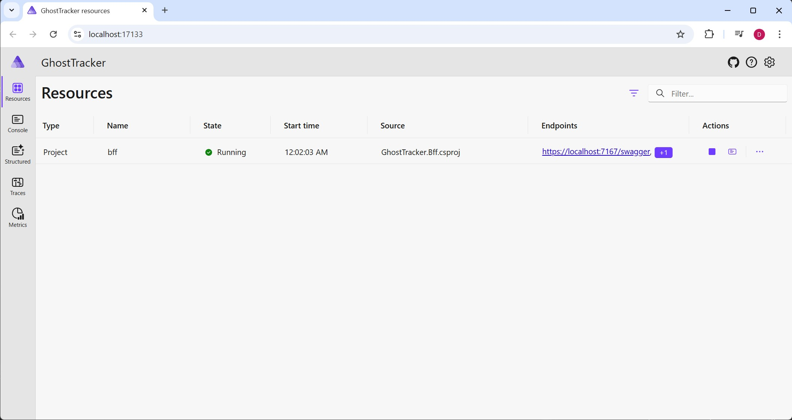
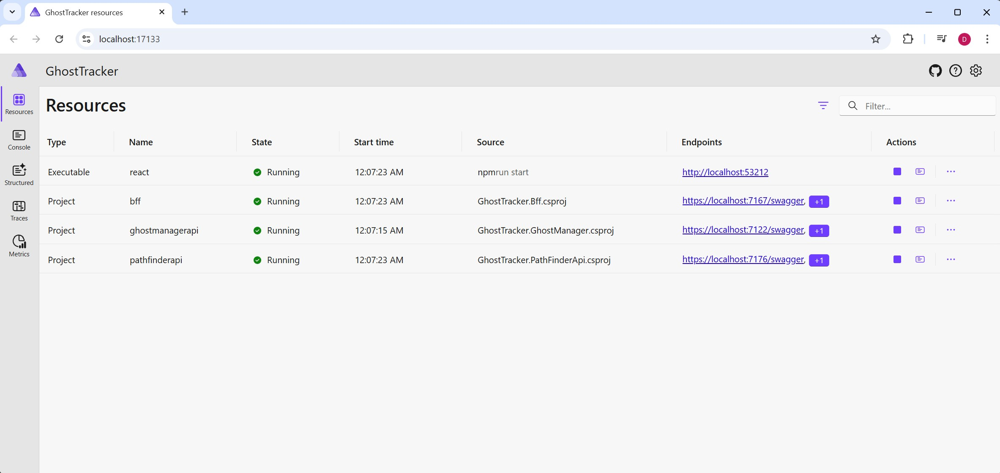
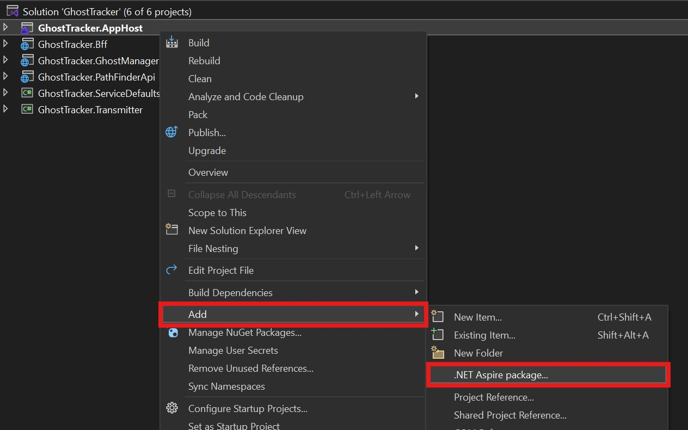

# Step 2 - Let's define our infrastructure

To run other projects in the solution, we need to define to our AppHost what to run and how to run it. Let's start by adding our BFF first.

If you used the Aspire CLI to create your AppHost, the project references should already be added. Now let's add the bff project to our Aspire builder with the following code:

```c#
builder.AddProject<Projects.GhostTracker_Bff>("bff");
```

Note that the static class `Projects.GhostTracker_Bff` is a class that was source generated by Aspire. A reference like this is created for each project dependency added to the AppHost project. The name that we specify as parameter of the method is the name used in the dashboard for the service. It is advised to keep the name of all resources one word without spaces because it will have more uses for other features later on in the exercise.

If we run our project now, we will see that the Bff project appears in the dashboard and has a link to its swagger page.



Now lets add our GhostsManager service and PathFinder service as well:

```c#
builder.AddProject<Projects.GhostTracker_GhostManager>("ghostmanagerapi");
builder.AddProject<Projects.GhostTracker_PathFinderApi>("pathfinderapi");
```

To add our react we need to take another approach. The `AddProject` method can only be used for other C# projects in the same solution. Fear not, Aspire offers a wide array for integration with a lot of different things. 

First, add the JavaScript hosting bundle by running this command in your AppHost folder:

```bash
aspire add javascript
```

This will add the `Aspire.Hosting.Javascript` nuget package, which allows us to integrate with any type of node application. Now add the following code to the builder:

```c#
builder.AddViteApp("react", "../GhostTracker.React")
    .WithEnvironment("BROWSER", "none") // Disable opening browser on npm start
    .WithHttpEndpoint(env: "PORT", name: "FrontendEndpoint") // We will be forwarding a random port on which the frontend will run.
```

The path `"../GhostTracker.React"` is relative to your AppHost project directory. Since both are in the Starter folder, this navigates up one level and into the React folder.

This code will start the react application by calling `npm start` in the specified folder when the AppHost is starting up. The `AddViteApp` integration will automatically run `npm install` before starting the frontend, so you don't need to run it yourself.

If you run the application again your dashboard should contain the frontend, bff, ghosts manager and pathfinder services. Make sure to check that the frontend works and check the Console, Structured, Traces and Metrics tab at the left on the dashboard.



## Expected Results

When you run the application, you should see:
- **BFF**: Swagger UI with API endpoints
- **GhostManager**: API service running
- **PathFinder**: API service running  
- **React**: Frontend application showing an empty map (this is expected at this stage)

Once you're done exploring you should have noticed that the frontend is working and you are able to see the console output of each application you started. The Console tab will show output, but Structured Logs and Metrics won't populate yet because we haven't configured OpenTelemetry for all services. We will be fixing this in the next step.

## Extra - Opinionated packages for you

Aspire is an opinionated framework defined by Microsoft. This is not only reflected in how Aspire works but is also related to Aspire specific nuget packages that are available. Each package with the owner "Aspire" is an Aspire package that is open source, probably created by the community and 100% curated by a panel of experts and architects from the Aspire team.

Explore the hosting options by opening the Nuget dependency manager and searching for `owner:Aspire` or select your AppHost project, right-click and go Add -> .NET Aspire Package...

You can also use the `Aspire add` command to search the aspire library through the cli.



When adding dependencies like RabbitMQ of SQLServer Aspire is able to deploy these dependencies itself, either by spinning up a docker image or by connecting to a configured existing instance. This for both the local development as deployment on Azure or other cloud providers.

Aspire differentiates Aspire packages in two categories: hosting and integration packages. Hosting packages are meant to be added to your AppHost project. They contain the code to setup an integration when building the application. Hosting packages typically start with `Aspire.Hosting.{packageName}`. Integration packages are opinionated implementations of how to integrate with hosted services. These integrations are typically pre-configured to setup health endpoint checks and structured logging for your integrations.
