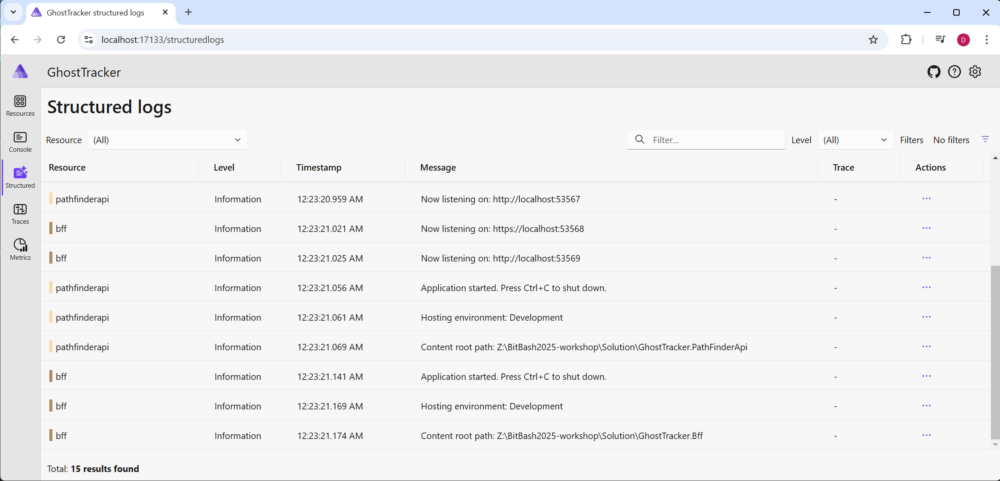
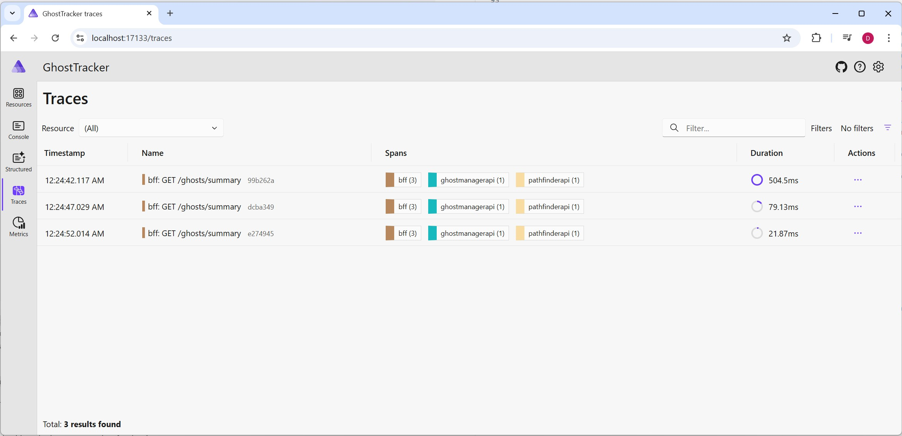

# Step 3 - Setting service defaults

To add structured logging, we need to apply open telemetry standard logging to all our services. This can be a lot of work to do right. Luckily Aspire can take care of this for us. The Aspire team has even defined a very handy base template to get started with.

## Understanding ServiceDefaults

When we added Aspire to the solution in the previous step using the .NET CLI, a `GhostTracker.ServiceDefaults` project was automatically created. You can find this project in your solution explorer. The project name ends with 'ServiceDefaults', which enables Visual Studio to recognize it and offer an "Add Service Default" option when adding new projects in the future. This ensures new projects automatically include the service defaults AND get added to the AppHost.

## What's in ServiceDefaults?

Take a look at the `GhostTracker.ServiceDefaults` project. You'll notice that it only contains an Extensions.cs file that exposes two important public extension methods:

1. **`AddServiceDefaults`** - Adds and configures:
   - **OpenTelemetry**: Distributed tracing, metrics collection, and structured logging
   - **Health Checks**: Endpoints that report service health status
   - **Service Discovery**: Automatic service-to-service communication configuration
   - **Standard Resiliency**: Retry policies and circuit breakers for HTTP calls

2. **`MapDefaultEndpoints`** - Adds default health check endpoints (`/health` and `/alive`) for development environments

Here's what the `AddServiceDefaults` method looks like under the hood:

```c#
public static IHostApplicationBuilder AddServiceDefaults(this IHostApplicationBuilder builder)
{
    builder.ConfigureOpenTelemetry();
    builder.AddDefaultHealthChecks();
    builder.Services.AddServiceDiscovery();
    
    builder.Services.ConfigureHttpClientDefaults(http =>
    {
        http.AddStandardResilienceHandler();
        http.AddServiceDiscovery();
    });
    
    return builder;
}
```

The purpose of this project is to centralize configuration that every service needs. Any standard configuration you want across all projects should be added to these methods.

## Adding ServiceDefaults to Your Services

Now we need to use these extension methods in our .NET services. Add the following code to the `Program.cs` file of the **Bff**, **GhostsManager**, and **PathFinder** projects.

Add `builder.AddServiceDefaults();` right after the builder is created.
Add `app.MapDefaultEndpoints();` after the app is built but before `app.Run()`:

```c#
var builder = WebApplication.CreateBuilder(args);

// Add this line
builder.AddServiceDefaults();

// ... rest of service configuration ...

var app = builder.Build();

// Add this line
app.MapDefaultEndpoints();

// ... rest of your middleware configuration ...
app.Run();
```

## Exploring the Results

Now when you start your project, the Aspire dashboard will show the benefits of adding ServiceDefaults:

- **Structured Logs**: View logs from all services in a unified format with correlation IDs
- **Traces**: See distributed traces showing requests flowing through multiple services
- **Metrics**: Monitor performance metrics like request duration, CPU usage, and more

Run the application and explore the dashboard:
1. Click on any service to view its logs
2. Navigate to the "Traces" tab to see end-to-end request flows
3. Check the "Metrics" tab to see performance data
4. Try the `/health` endpoint on any service to verify health checks are working




You've now configured all your .NET services with production-ready observability, health checks, and resilience patterns!

**Note:** There are no default ServiceDefaults for the React project. ServiceDefaults are only for .NET services, not frontend applications.

> **Learn More:** For detailed information about service defaults, see the [official Aspire documentation](https://aspire.dev/fundamentals/service-defaults/).

## Additional Resources

- [OpenTelemetry in .NET Aspire](https://aspire.dev/fundamentals/telemetry/)
- [Health Checks in .NET Aspire](https://aspire.dev/fundamentals/health-checks)

---

[Next Exercise →](./exercise_04.md)