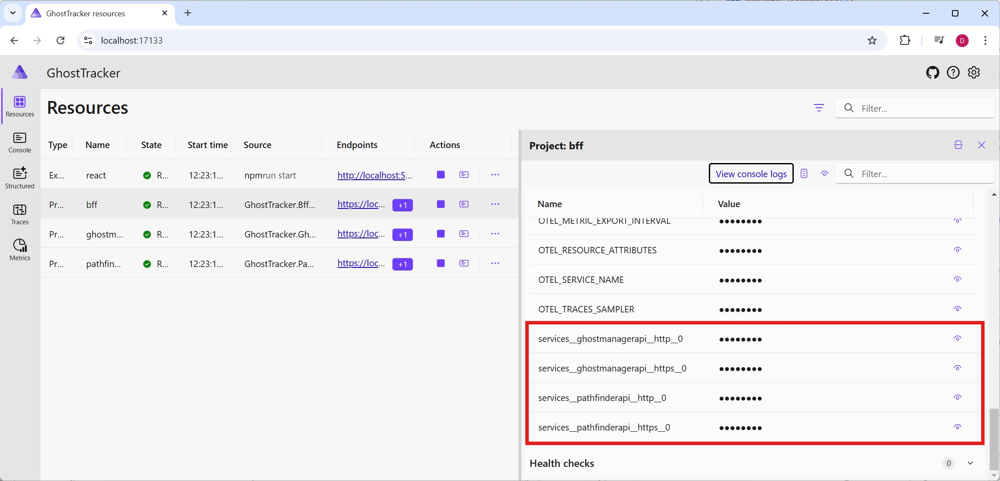

# Step 4 - Service discovery

In the service defaults a "ServiceDiscovery" module is added to your services. This is a very handy nuget package extension that helps with making calls to other services. Currently when the BFF talks to the manager and pathfinder services, it does so with a hard-coded url and port. This is not ideal since Aspire can assigns random ports each time the application runs.

```c#
// Currently in GhostTracker.Bff program.cs
builder.Services.AddHttpClient<GhostManagerApi>(static client => client.BaseAddress = new("https://localhost:7122"));
builder.Services.AddHttpClient<PathFinderApiClient>(static client => client.BaseAddress = new("https://localhost:7176"));
```

With Service Discovery we can make this a lot easier by using logical service names instead of hardcoded URLs. 

## Configuring Service References

To start we need to tell Aspire and Service Discovery that the Bff needs a reference to the manager and pathfinder service. This can be configured in the AppHost as follows:

```c#
var ghostManagerApi = builder.AddProject<Projects.GhostTracker_GhostManager>("ghostmanagerapi");
var pathfinderApi = builder.AddProject<Projects.GhostTracker_PathFinderApi>("pathfinderapi");

var bff = builder.AddProject<Projects.GhostTracker_Bff>("bff")
    .WithReference(ghostManagerApi)
    .WithReference(pathfinderApi);
```

Here we store the project references in variables (`ghostManagerApi` and `pathfinderApi`) so we can pass them to the `WithReference()` calls. This tells Aspire that the BFF service depends on these two services.

What this will do behind the scenes is add environment variables to the BFF service. Aspire automatically creates environment variables when references are made, using a specific format that the Service Discovery package understands. You can see these environment variables by viewing the details of the bff service in the dashboard.



Notice that the name we gave to each project in our AppHost project is used as part of the environment variable name. The format is `services__<servicename>__<protocol>__0`, where the nested structure helps organize multiple endpoints per service.

## Updating the BFF Code

Now we need to update the BFF service to use Service Discovery. We do this by changing the hardcoded URLs to use the logical service names we defined in the AppHost. The order of changes doesn't matter - you can update the AppHost first or the BFF first.

Replace the hardcoded URLs with logical service names:

```c#
builder.Services.AddHttpClient<GhostManagerApi>(static client => client.BaseAddress = new("https://ghostmanagerapi"));
builder.Services.AddHttpClient<PathFinderApiClient>(static client => client.BaseAddress = new("https://pathfinderapi"));
```

Notice we keep the `https://` protocol but replace the hostname and port with the service name. The Service Discovery middleware intercepts these requests and resolves the logical service names to actual endpoints.

## How Service Discovery Works

When you make a request to `https://ghostmanagerapi`:
1. The Service Discovery middleware intercepts the HTTP request
2. It looks for an environment variable matching the service name (e.g., `services__ghostmanagerapi__https__0`)
3. It finds the actual URL and port assigned by Aspire
4. It replaces your logical name with the real endpoint
5. Your HttpClient connects to the actual service

This approach is not only handy to improve local development but is also useful when deploying to different environments. The service discovery package can hook into Kubernetes service discovery and other cloud-native discovery mechanisms.

## Testing Your Changes

After making these changes, run the application and verify everything works:

1. Open the BFF Swagger UI from the Aspire dashboard
2. Call an endpoint that uses GhostManagerApi (e.g., GET /ghosts)
3. Check the **Traces** tab in the dashboard - you should see the BFF calling the GhostManager
4. The call should succeed without any hardcoded ports

## Important Notes

⚠️ **Service names are case-sensitive!** The name you use in `.AddProject("ghostmanagerapi")` must exactly match the name in your HttpClient base address `https://ghostmanagerapi`. A misspelling will cause Service Discovery to fail to find the base address, resulting in connection errors.

💡 **Why this matters:** Aspire assigns random available ports each time the application starts, so hardcoded ports won't work reliably across restarts. Service Discovery solves this by always using the current, correct endpoint.

## Learn More

For more details about Service Discovery in .NET Aspire, see the official documentation:
- [Service Discovery in .NET Aspire](https://learn.microsoft.com/dotnet/aspire/service-discovery/overview)
