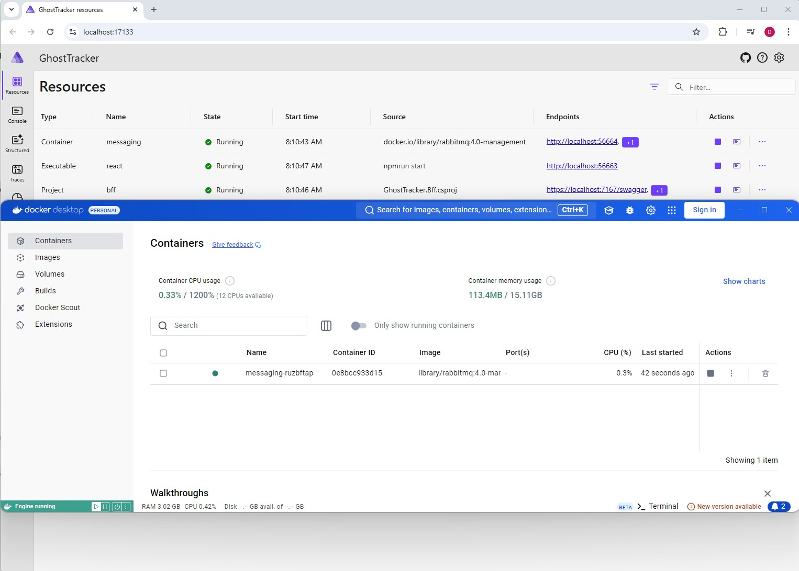

# Step 6 - Integrations

Next we are going to have a look at how to integrate with a third party package via Aspire. For this we are going to use the `GhostTracker.Transmitter.RabbitMQ` project. This project is going to work exactly the same as the previous transmitter we worked with but is going to send it's messages through RabbitMQ instead of through HTTP requests.

With RabbitMQ integration, we'll demonstrate event-driven architecture alongside the HTTP-based communication from Step 5. Both transmitters will run simultaneously, using different communication patterns.

## Prerequisites

⚠️ **Make sure Docker Desktop is running before starting the application.** Aspire needs Docker to spin up the RabbitMQ container.

## Adding RabbitMQ to the AppHost

Start by adding RabbitMQ as a service to our AppHost. We can look in the Aspire package catalogue for a hosting package for RabbitMQ. This is the `Aspire.Hosting.RabbitMQ` package.

First, add the package to the AppHost project using the Aspire CLI:

```powershell
aspire add rabbitmq
```

When this package is added, we can configure RabbitMQ in our AppHost with the following code:

```csharp
var rabbitmq = builder.AddRabbitMQ("messaging")
    .WithManagementPlugin();
```

Adding this code will make Aspire run a containerized version of RabbitMQ in Docker. The `"messaging"` name is important - we'll use this same name when configuring clients to connect to RabbitMQ.

The `WithManagementPlugin()` method enables RabbitMQ's web-based management UI, which provides:
- Queue monitoring and message inspection
- Performance metrics
- User and permission management
- Visual overview of your messaging topology

You can login to the management UI with the default credentials (username: `guest`, password: `guest`).

If you run your application again, you should be able to see the RabbitMQ container in your docker and in the dashboard. Once your stop the application, the container will be removed again.



It is also possible to keep the container alive for a faster startup of your application:

```csharp
var rabbitmq = builder.AddRabbitMQ("messaging")
    .WithManagementPlugin()
    .WithLifetime(ContainerLifetime.Persistent);
```

## Configuring the Transmitter

Now that we have a RabbitMQ instance running, let's setup our transmitter. Start by adding a transmitter to our AppHost and referencing RabbitMQ:

```csharp
builder.AddProject<Projects.GhostTracker_Transmitter_RabbitMQ>("ghosttracker-transmitter-rabbitmq")
    .WithReference(rabbitmq);
```

Next, go to the `GhostTracker.Transmitter.RabbitMQ` project. First we need to add a NuGet package to connect to RabbitMQ:

```powershell
dotnet add package Aspire.RabbitMQ.Client
```

The `Aspire.RabbitMQ.Client` is a low-level RabbitMQ client that is already configured with health checks, logging, and telemetry.

After the package is added, you can setup RabbitMQ in `Program.cs`:

```csharp
builder.AddRabbitMQClient(connectionName: "messaging");
```

Notice that the `connectionName` parameter uses `"messaging"` - this **must match** the name we used in `AddRabbitMQ("messaging")` in the AppHost. The Service Discovery package will automatically supply the connection string from our configuration, so we don't need to manage it manually.

## Configuring the Consumers

The same needs to be done for the **GhostManager** and **PathFinder** projects. 

### For both GhostManager and PathFinder:

1. Add the NuGet package:
   ```bash
   dotnet add package Aspire.RabbitMQ.Client
   ```

2. In the AppHost, add references to RabbitMQ:
   ```csharp
   builder.AddProject<Projects.GhostTracker_GhostManager>("ghosttracker-ghostmanager")
       .WithReference(rabbitmq);
   
   builder.AddProject<Projects.GhostTracker_PathFinderApi>("ghosttracker-pathfinderapi")
       .WithReference(rabbitmq);
   ```

3. In each project's `Program.cs`, add the RabbitMQ client registration:
   ```csharp
   builder.AddRabbitMQClient(connectionName: "messaging");
   ```

4. Register the message listeners. The `RabbitMqListener` classes are already present in each project's `Services` folder. Just uncomment the code in `RabbitMqListener.cs`. Add a service registration in `program.cs`:
   ```csharp
   builder.Services.AddHostedService<RabbitMqListener>();
   ```

## Understanding the Message Flow

Here's how the messages flow through the system:
1. **Transmitter.RabbitMQ** publishes ghost location updates to RabbitMQ queues
2. **GhostManager** subscribes via its `RabbitMqListener` to receive ghost updates
3. **PathFinderApi** subscribes via its `RabbitMqListener` to receive location data
4. This demonstrates event-driven architecture alongside the HTTP-based transmitter from Step 5

## Verification

Once this is done, run the application and verify:

1. **Check the Dashboard** - You should see a new "messaging" resource with RabbitMQ
2. **RabbitMQ Management UI**:
   - Click the link to the RabbitMQ management interface in the dashboard
   - Login with username: `guest`, password: `guest`
   - Navigate to the **Queues** tab
   - You should see queues with messages being processed
3. **React Frontend** - Verify that ghosts from both the HTTP transmitter and RabbitMQ transmitter are appearing

## Additional Resources

For more information, see the official documentation: [Aspire RabbitMQ Integration](https://aspire.dev/integrations/messaging/rabbitmq/)
